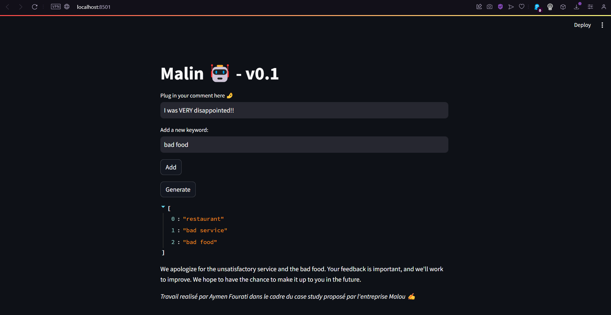
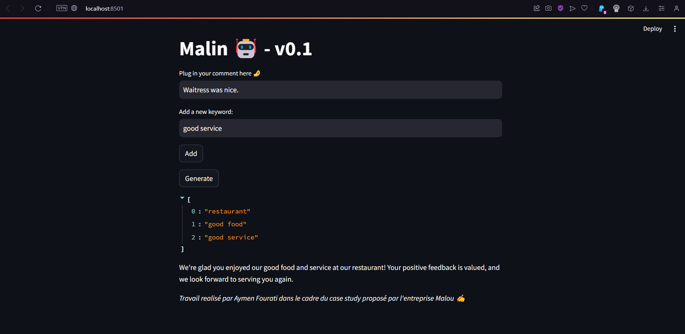

Travail realisé par Aymen Fourati dans le cadre du processus de recrutement chez Malou.

Plan :

1) Introduction
2) Stack technique et discussions
3) Création de la base de données
4) Fine tuning de GPT2
5) Les KPI monitorés
6) Lancement de l'application..

----------------------------------------------------------------------------------

# 1) Introduction :

On se propose de faire le proof of concept d'un répondeur automatique aux feedbacks clients.
Pour se contextualiser sur l'expertise de Malou ( et notament converger le modele plus rapidement ), on va se focaliser sur les experiences culinaires. 

# 2) Stack technique et discussions :

Au debut, nous avons tenté de faire le fine tunning de Falcon 7b : Un LLM open source et ouvert à l'utilisation comerciale mais le modelea montré des signes d'instabilité lors de l'entrainement.

Ducoup, le modele que nous avons choisie de fine tuné pour est gpt2 le modele open source d'open ai. Nous avons pensé qu'il serait judicieux de nous orienté vers leurs technologies pour une eventuel migration convenable vers un fine-tuned gpt4. Pour ce fair, nous utilisons la librairie Transformer de HuggingFace : 

    from transformers import GPT2LMHeadModel, GPT2Tokenizer, GPT2Config
    from transformers import TextDataset, DataCollatorForLanguageModeling
    from transformers import Trainer, TrainingArguments

Nous avons aussi mis en place un UI a l'aide de Langchain un framework d'integration de LLMs ( restant sur la meme optique de flexibilité puisque Langchain presente une grande panoplie de source de LLMs comme openAi ) :

    pip install langchain
    pip install huggingface_hub
    pip install streamlit
    pip install python-dotenv

Langchain nous a permis nous connecter a HuggingFace pour consommer l'API de notre modele sans avoir a telecharger toutes les dependances en locale.

Cette configuration nous permet de passer d'un modele a un autre sans avoir a effectuer des changement dans l'application web et de garder un pipeline de test du modele séparer de l'environement de devleoppement de l'application web.

# 3) Création de la base de données :

Faute de base de données de réferences, on va créer un dataset apartir d'un repo de commentaires emprunté de Kaggle : https://www.kaggle.com/datasets/vigneshwarsofficial/reviews/data

Le fichier est aussi present dands le repertoire sous le nom Restaurant_Reviews.tsv

Nous choisisons de structurer notre dataset comme suite : 

    {
        keywords : string [], // Tableaux de mots pour contextualiser l'avis client.
        comment : string, // l'avis client apartir de la dataset de Kaggle.
        reply : string, // une réponse generé par gpt 3.5 pour l'entrainement du modele.
        satisfaction : Binary // 1 si avis positif 0 sinon. Cet attribut ne joue aucun role dans l'entrainement du modele mais il nous permet d'équilibrer les classes correctement en phase de pretraitement.
    }

Les keywords sont de trois type principalement : 

type 1 : Restaurant : Le premier keyword sera toujours "restaurant" et cela pour introduire de la scalabilité au dataset ( en pourra par exemple elargire le dataset en rajoutant d'autre service comme Bar ou Café sans perturber la performance du modele )

type 2 : Contextualization : A la maniere d'un hashtag pour contextualiser l'avis client par exemple si l'avis émane d'un commentaire sur une offre de promo sur un post facebook on aurra un keyword "20% promo" 

type 3 : Subset du commentaire : Divers mots figurant dans le commentaire ( qui pourait etre generé par une intersection avec une base de donnée de mots clés que nous jugons interessant)

    Exemples : mots interessants :["chicken soup", "kids menu", "pizza", "hamburger", "beer", "steak"..]
    commentaire : "Amazing chicken soup ! However, The steak was a bit raw.."
    --> keywords ["restaurant", "chicken soup", "steak", "saturday night"] 

Voici un subset de ce dataset :

    ...
    {
        "keywords": ["restaurant", "positive experience", "grand reopening event", "new menu launch"],
        "comment": "Overall, I like this place a lot.",
        "reply": "We're thrilled to hear that you enjoyed your experience! Thank you for your positive feedback. The grand reopening event and new menu launch have been exciting for us, and we look forward to serving you again.",
        "satisfaction": 1
        },
        {
          "keywords": ["restaurant", "delightful first visit", "chef's special creations"],
          "comment": "My first visit to Hiro was a delight!",
          "reply": "We're thrilled to hear that your first visit was delightful! Our chef has introduced special creations that we hope will continue to impress you. Thank you for choosing Hiro, and we look forward to your next visit.",
          "satisfaction": 1
        },
        {
          "keywords": ["restaurant", "ample portions", "special pricing", "culinary innovations"],
          "comment": "Ample portions and good prices.",
          "reply": "Thank you for your positive feedback on our portions and prices! We're excited to share that we're constantly working on culinary innovations to enhance your dining experience.",
          "satisfaction": 1
        },
    ...

# 4) Fine-tuning de GPT2 :

Cette partie est decrite dans le fichier gpt2-finetuning.ipynb

# 5) Les KPI monitorés :

## Temps de reponse :

 L'une des metrics les plus importantes et qui nous a obligé a nous retourner vers gpt2 au lieu de falcon 7b est le temps de reponse. En effet, dans un environement prod, on aimerait bien que le client resoivent une reponse sur son commentaire instantanement ( avant qu'il ne quitte la page ! ) ( Par exemple le chatbot agis sur les commentaires des posts facebook d'un restaurant ). pour le moment, le temps de reponse est au alentour de 20 secondes.

## Taux de réponse :

 Certe, les reponses de GPT2 sont parfois de tres bonne qualité mais il reste toujours le risque de ne pas avoir de reponse.

---------------------------------------------------------------------

# 6) Lancement de l'application :

dans le repertoire ui lancer cette commande apres avoir telechargé les dependances :

      python -m streamlit run malin.py

NB : Il faut taper sur ENTRER pour valider les mots ecrit dans le prompt.

Voici des exemples à testé :

keywords = ["restaurant","negative experience"]
comment = "This place is way too overpriced for mediocre food."

keywords = ["restaurant","positive experience","good service"]
comment = "Service was fine and the waitress was friendly."

keywords = ["restaurant","good experience"]
comment = "If you want healthy authentic or ethic food, try this place."

keywords = ["restaurant","good waitress"]
comment = "Waitress was sweet and funny."

keywords = ["restaurant","Bad service"]
comment = "We've have gotten a much better service from the pizza place next door than the services we received from this restaurant."

Merci pour votre temps ! 
